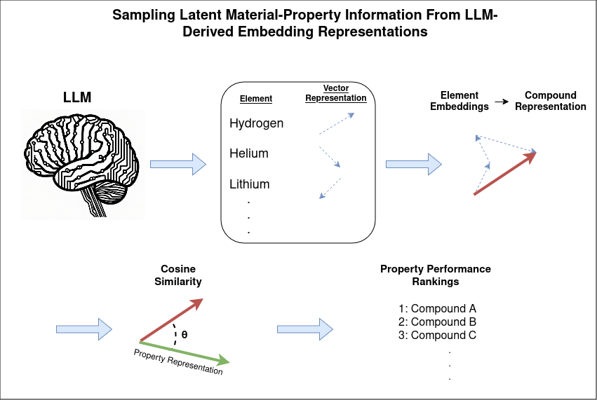

# LLM-Material-Embeddings

Vector embeddings derived from large language models (LLMs) show promise in capturing latent information from the literature. Interestingly, these can be integrated into material embeddings, potentially useful for data-driven predictions of materials properties. We investigate the extent to which LLM-derived vectors capture the desired information and their potential to provide insights into material properties without additional training. Our findings indicate that, although LLMs can be used to generate representations reflecting certain property information, extracting the embeddings requires identifying the optimal contextual clues and appropriate comparators. Despite this restriction, it appears that LLMs still have the potential to be useful in generating meaningful materials-science representations.

> [PAPER HERE](https://doi.org/10.1016/j.mtcomm.2024.110858)

## Create Embeddings

The jupyter notebook in the "Embeddings" folder loads a given LLM model using the huggingface transformers library and takes the final embedding layer. It will then compare the rankings of different quasi-contextualizations and queries with the ground truth and generate a heat map as can be found [here](https://doi.org/10.1016/j.mtcomm.2024.110858).
